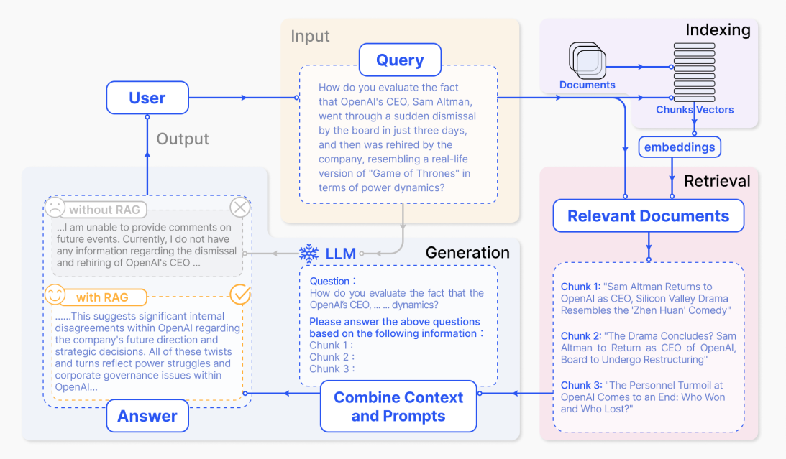

# AI chatbot for your private documents

Chat with your private documents.Simply upload any document or PDF and get instant answers.For now,
this system support PDF,Text,CSV and Docx file types.


## Overview

This project use RAG system for document chatting.

#### Retrieval Augmented Generation (RAG)

RAG or Retrieval Augmented Generation can be fine-tuned and its internal knowledge can be modified in an efficient manner and without needing retraining of the entire model.RAG takes an input and retrieves a set of relevant/supporting documents given a source (e.g., Wikipedia). The documents are concatenated as context with the original input prompt and fed to the text generator (LLMs) which produces the final output. This makes RAG adaptive for situations where facts could evolve over time.RAG allows language models to bypass retraining, enabling access to the latest information for generating reliable outputs via retrieval-based generation.



IMG Source : [RAG-survey](https://arxiv.org/pdf/2312.10997.pdf)


## 🚀 Installation

Create the conda environment using following command
```
conda env create -f environment.yml

conda activate chatbot
```
```
CMAKE_ARGS="-DLLAMA_BLAS=ON -DLLAMA_BLAS_VENDOR=OpenBLAS"
```
>:memo: **_NOTE:_** Current system use [llama-cpp-python](https://github.com/abetlen/llama-cpp-python) and run only on ubuntu and CPU if you want to run in other OS read the following [Installation instructions](https://github.com/abetlen/llama-cpp-python#installation-configuration)
of llama-cpp-python library!

###### Requirements
This project aim to run on local computer and support to run on CPU(currently)

1. Memory (at least 8GB RAM)
2. Ubuntu/Debian(18.4 or above)


## Runing the system
Manually download following LLM and move to model/ folder
- LLM ( 4bit quantized version of mistral-7b instruct model )

    - [mistral-7b-instruct-v0.2.Q4_K_S](https://cdn-lfs-us-1.huggingface.co/repos/72/62/726219e98582d16c24a66629a4dec1b0761b91c918e15dea2625b4293c134a92/1213e19b3e103932fdfdc82e3b6dee765f57ad5756e0f673e7d36514a5b60d0a?response-content-disposition=attachment%3B+filename*%3DUTF-8%27%27mistral-7b-instruct-v0.2.Q4_K_S.gguf%3B+filename%3D%22mistral-7b-instruct-v0.2.Q4_K_S.gguf%22%3B&Expires=1711613863&Policy=eyJTdGF0ZW1lbnQiOlt7IkNvbmRpdGlvbiI6eyJEYXRlTGVzc1RoYW4iOnsiQVdTOkVwb2NoVGltZSI6MTcxMTYxMzg2M319LCJSZXNvdXJjZSI6Imh0dHBzOi8vY2RuLWxmcy11cy0xLmh1Z2dpbmdmYWNlLmNvL3JlcG9zLzcyLzYyLzcyNjIxOWU5ODU4MmQxNmMyNGE2NjYyOWE0ZGVjMWIwNzYxYjkxYzkxOGUxNWRlYTI2MjViNDI5M2MxMzRhOTIvMTIxM2UxOWIzZTEwMzkzMmZkZmRjODJlM2I2ZGVlNzY1ZjU3YWQ1NzU2ZTBmNjczZTdkMzY1MTRhNWI2MGQwYT9yZXNwb25zZS1jb250ZW50LWRpc3Bvc2l0aW9uPSoifV19&Signature=OoqJBnwVitE6chKaBwR4VSFleRfsdpHZOUnmw72LIVyLbzpHRlABtwnHMgqjkwBN4d1Uz9EfJmklPFrjVZp7kiKNyetDbNww2GfZrA6MQW4%7EwXJ6TIgIvqNjxSf1yq-9eSMnEOrrKh3ljwQufYzvAGMg2xEDU5mu-Y-T5vzeffCyO00LeUZ5Xeoo71upvhYAOPydC9k7HStriaLVcc6TMUBduBOd%7Ey83Q9Cd47E0LXSMHkNHD5GWn4bE6dt-L9ZFVaZUNN7XXlEq2Q4GFyAC9-tEIysRKwPLezDJZXBilVY4UWtn8Zjw2RK7nvEEPIT7-iNqgGbZBkjTH6Ep5layRQ__&Key-Pair-Id=KCD77M1F0VK2B)

>:bulb: **_NOTE:_** If you want to use other LLM or custom GGUF models , take a look at .env file and edit model name.


## Documentation
More about RAG system , models and possible improvements can be found in
following documenations:

   1. [System Design](docs/00_system_overview.md)
   2. [Models](docs/01_models.md)
   3. [System Improvement](docs/02_system_improvements.md)
   4. [Futher improvements](docs/03_futher_imporvements.md)
