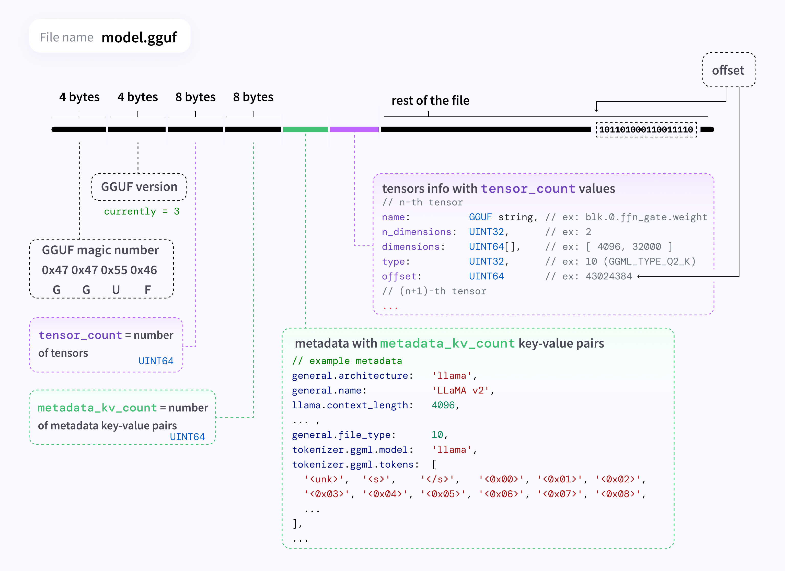

## Models

The chat system use following models to build RAG system.The RAG system use Embedding model for semantic search (.aka context search) and LLM for content generation.

1. LLM ( 4bit quantized version of Mistral-7b instructv0.2 model )
    The Mistral-7B-Instruct-v0.2 Large Language Model (LLM) is an instruct fine-tuned version of the Mistral-7B-v0.2.
    Mistral-7B-v0.2 has the following changes compared to Mistral-7B-v0.1

    - 32k context window (vs 8k context in v0.1)
    - Rope-theta = 1e6
    - No Sliding-Window Attention
    

    For full details of this model please read original [paper](https://arxiv.org/abs/2310.06825) and [release blog post](https://mistral.ai/news/la-plateforme/).

    
2. Embedding model ( BAAI/bge-small-en-v1.5 )

    BGE embedding is a general Embedding Model.Pre-train the models using [retromae](https://github.com/staoxiao/RetroMAE) and train them on large-scale pair data using contrastive learning. 
    - bge is short for BAAI general embedding.
    - [Detail of bge * models](https://github.com/FlagOpen/FlagEmbedding)

## More about format

1. GGUF format 

    In this RAG system I use GGUF models for computational efficiency.GGUF is a file format for storing models for inference with GGML and executors based on GGML. GGUF is a binary format that is designed for fast loading and saving of models, and for ease of reading. Models are traditionally developed using PyTorch or another framework, and then converted to GGUF for use in GGML.

    1. GGUF Specification
        - Single-file deployment
        - mmap compatibility: models can be loaded using mmap for fast loading and saving
        - Full information: all information needed to load a model is contained in the model file

    2. GGUF File Structure
    
     IMG Source : [GGUF format](https://private-user-images.githubusercontent.com/1991296/313174776-c3623641-3a1d-408e-bfaf-1b7c4e16aa63.png?jwt=eyJhbGciOiJIUzI1NiIsInR5cCI6IkpXVCJ9.eyJpc3MiOiJnaXRodWIuY29tIiwiYXVkIjoicmF3LmdpdGh1YnVzZXJjb250ZW50LmNvbSIsImtleSI6ImtleTUiLCJleHAiOjE3MTEzNzU1ODcsIm5iZiI6MTcxMTM3NTI4NywicGF0aCI6Ii8xOTkxMjk2LzMxMzE3NDc3Ni1jMzYyMzY0MS0zYTFkLTQwOGUtYmZhZi0xYjdjNGUxNmFhNjMucG5nP1gtQW16LUFsZ29yaXRobT1BV1M0LUhNQUMtU0hBMjU2JlgtQW16LUNyZWRlbnRpYWw9QUtJQVZDT0RZTFNBNTNQUUs0WkElMkYyMDI0MDMyNSUyRnVzLWVhc3QtMSUyRnMzJTJGYXdzNF9yZXF1ZXN0JlgtQW16LURhdGU9MjAyNDAzMjVUMTQwMTI3WiZYLUFtei1FeHBpcmVzPTMwMCZYLUFtei1TaWduYXR1cmU9YzA3YmVlYzI4M2M5YWVmYWFmY2RhZjMzM2YwMGY1YTM4YWRlNjdiZTQ0YzdhMzBjMGM0YTdiYjFiMzczYjhkNCZYLUFtei1TaWduZWRIZWFkZXJzPWhvc3QmYWN0b3JfaWQ9MCZrZXlfaWQ9MCZyZXBvX2lkPTAifQ.dtJRk4xTKVvByiAoYQHIzj9foUl0a5m8n9Cqe7JH2ks)

## Side note

This side note depend on my personal experience and I only run in CPU (GGUF version).The results may be varies on other hardware(CPU/GPU),LLM backend(vLLM/tensorRT_LLM),precison(fp16,fp32,int8) etc. So use this side note as reference.

>:bulb: **_NOTE:_** This is side note form LLM choosing.Other light weight model like microsoft(phi2) is small in term of parameters and in benchmark the model pass in other models but not good in generation.